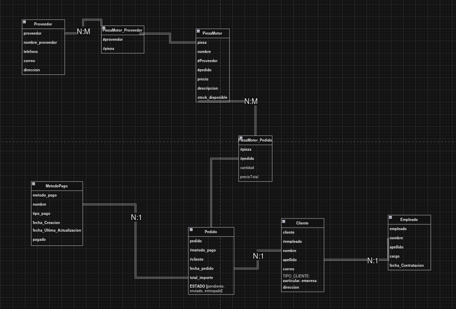

# Proyecto de Gestión de Pedidos de Piezas de Motor

Este proyecto implementa una base de datos para gestionar pedidos de piezas de motor, con funcionalidades para administrar clientes, empleados, proveedores, métodos de pago, y piezas de motor. El sistema permite realizar consultas avanzadas a través de diferentes vistas y URLs, optimizadas para un rendimiento eficiente en Django.

Ejemplos de diferentes **template tags**, **operadores**, **formato de fechas** y **template filters** usados en Django para manejar datos en plantillas. A continuación se detallan los diferentes tipos utilizados en el proyecto:

## Template Tags

1. **forloop.counter**  
   - **Archivo:** `contenido_todosClientes`  
   - **Utilidad:** Mostrar el índice donde se encuentra en el diccionario.  
   - **Etiqueta:**  
     ```html
     <li>Cantidad de registros en la tabla cliente: {{ forloop.counter }}</li>
     ```

2. **if else**  
   - **Archivo:** `contenido_ClienteEmpleado_anio_mes`  
   - **Utilidad:** Si hay un cliente que se relaciona con un empleado, mostrará el nombre del empleado.  
   - **Etiqueta:**  
     ```html
     
     ```

3. **for empty**  
   - **Archivo:** `clientepedidoinverso`  
   - **Utilidad:** Muestra un texto por defecto si no hay elementos que iterar.  
   - **Etiqueta:**  
     ```html
     <li>No hay información.</li>
     ```

4. **comment**  
   - **Archivo:** `clientepedidoinverso`  
   - **Utilidad:** Añade comentarios dentro del código que no se muestran en la salida.  
   - **Etiqueta:**  
     ```html
     
     Usas el relative name para acceder a los atributos de pedido y all
     
     ```

5. **include**  
   - **Archivo:** `clientepedidoinverso`  
   - **Utilidad:** Permite incluir una plantilla dentro de otra.  
   - **Etiqueta:**  
     ```html
     
     ```

## Operadores

1. **<**  
   - **Archivo:** `contenido_Calculospedidos`  
   - **Condición:** Si `minimo` es negativo no muestra el resultado.  
   - **Ejemplo:**  
     ```html
     
     ```

2. **==**  
   - **Archivo:** `contenido_todosClientes`  
   - **Condición:** Si el cliente es igual a una 'E'.  
   - **Ejemplo:**  
     ```html
     
     ```

3. **>**  
   - **Archivo:** `contenido_Calculospedidos`  
   - **Condición:** Si la media es mayor que 0.  
   - **Ejemplo:**  
     ```html
     
     ```

4. **>=**  
   - **Archivo:** `contenido_todosClientes`  
   - **Condición:** Si el ID del cliente es mayor o igual a 4.  
   - **Ejemplo:**  
     ```html
     
     ```

5. **<=**  
   - **Archivo:** `contenido_Pedidos_pendientes_pagados`  
   - **Condición:** Si el ID del cliente es menor o igual a 2.  
   - **Ejemplo:**  
     ```html
     <li>id cliente {{ tablas.cliente_id <= 5}}</li>
     ```

## Formato Correcto de Fechas

1. **Archivo:** `contenido_muestraTodos`  
   - **Atributo:**  
     ```html
     {{ tabla.pedido.fecha_pedido|date:"d/m/Y" }}
     ```

2. **Archivo:** `contenido_Pedidos_enviados_O_entregados`  
   - **Atributo:**  
     ```html
     <li>Fecha del pedido: {{ p_e.fecha_pedido|date:"d/m/Y"}}</li>
     ```

3. **Archivo:** `contenido_ClienteEmpleado_anio-mes`  
   - **Atributo:**  
     ```html
     <p>{{ cliente.empleado.fecha_contratacion|date:"d-m-Y" }}</p>
     ```

## Template Filters

1. **upper**  
   - **Archivo:** `contenido_todosClientes`  
   - **Utilidad:** Muestra el contenido en mayúsculas.  
   - **Atributo:**  
     ```html
     <li>Nombre del Cliente: {{ cliente.cliente|upper }}</li>
     ```

2. **lower**  
   - **Archivo:** `contenido_todosClientes`  
   - **Utilidad:** Muestra el contenido en minúscula.  
   - **Atributo:**  
     ```html
     <li>Tipo de cliente: {{ cliente.tipo_clientes|lower }}</li>
     ```

3. **floatformat**  
   - **Archivo:** `contenido_CalculosPedidos`  
   - **Utilidad:** Se usa para indicar la cantidad de decimales.  
   - **Atributo:**  
     ```html
     <li>El máximo es: {{ maximo|floatformat:1 }}</li>
     ```

4. **length**  
   - **Archivo:** `contenido_ClienteEmpleado_anio_mes`  
   - **Utilidad:** Obtiene la longitud del campo.  
   - **Atributo:**  
     ```html
     <p>Longitud del campo empleado: {{ cliente.empleado.empleado|length }}</p>
     ```

5. **truncatechars**  
   - **Archivo:** `contenido_Pedidos_pendientes_pagados`  
   - **Utilidad:** Muestra una cantidad de caracteres determinada.  
   - **Atributo:**  
     ```html
     <li>Nombre del pedido: {{ tablas.pedido|truncatechars:10 }}</li>
     ```

6. **slice**  
   - **Archivo:** `contenido_todosClientes`  
   - **Utilidad:** Selecciona por índices una cadena de texto (no muestra `...`, es diferente de `truncatechars`).  
   - **Atributo:**  
     ```html
     <li>Apellido: {{ cliente.apellido|slice:":10" }}</li>
     ```

7. **join**  
   - **Archivo:** `contenido_todosClientes`  
   - **Utilidad:** Usa un separador.  
   - **Atributo:**  
     ```html
     <li>Correo: {{ cliente.correo|join:"." }}</li>
     ```

8. **join**  
   - **Archivo:** `contenido_Pedidos_pendientes_pagados`  
   - **Utilidad:** Muestra el texto con numeración de línea.  
   - **Atributo:**  
     ```html
     <li>Método de pago: {{ tablas.metodo_pago.pagado|linenumbers}}</li>
     ```

9. **add**  
   - **Archivo:** `contenido_Calculospedidos`  
   - **Utilidad:** Suma según el valor.  
   - **Atributo:**  
     ```html
     <p>La media es: {{ media|add:10 }} y es mayor que 0</p>
     ```

10. **divisibleby**  
    - **Archivo:** `contenido_Calculospedidos`  
    - **Utilidad:** Verifica si un número es divisible por otro.  
    - **Atributo:**  
      ```html
      <p>¿La media es divisible entre 2? {{ media|divisibleby:2 }}</p>
      ```


## Descripción de la Base de Datos

La base de datos incluye las siguientes tablas principales:

1. **Proveedor**: Almacena la información de los proveedores de piezas de motor, como nombre, teléfono, correo y dirección.

2. **PiezaMotor**: Registra cada pieza de motor, incluyendo su nombre, precio, descripción, stock disponible y sus proveedores asociados.

3. **Cliente**: Gestiona los datos de los clientes, como nombre, apellido, correo, dirección y tipo de cliente (particular o empresa).

4. **Empleado**: Contiene la información de los empleados, incluyendo nombre, apellido, cargo y fecha de contratación.

5. **Pedido**: Representa los pedidos realizados por los clientes, incluyendo el cliente asociado, el método de pago, la fecha del pedido, el total importe y el estado (pendiente, enviado, entregado).

6. **MetodoPago**: Define los métodos de pago disponibles, con detalles como nombre, tipo de pago, fecha de creación y estado (pagado o no).

7. **Tablas Intermedias**:
   - **PiezaMotor_Proveedor**: Relaciona las piezas de motor con los proveedores que las suministran.
   - **PiezaMotor_Pedido**: Une las piezas de motor con los pedidos, indicando la cantidad y el precio total de cada pieza en el pedido.

## Vistas

El archivo `views.py` contiene varias vistas para realizar diferentes consultas sobre los datos de la base de datos. A continuación, se describen algunas de las principales:

- **index**: Muestra la página principal.
- **mostrar_clientes**: Lista todos los clientes.
- **mostrar_pedidocliente**: Muestra los pedidos asociados a un cliente específico.
- **mostrartodosdatos**: Muestra todos los datos almacenados en el sistema.
- **empleadoatiendecliente**: Lista los clientes atendidos por un empleado específico.
- **pedidos_enviados_pagados**: Filtra los pedidos que están pendientes o pagados.
- **proveedor_piezamotor**: Muestra las piezas de motor de un proveedor específico.
- **proveedor_detalle**: Detalla la información del proveedor, filtrando los nombres que comienzan con una letra mayúscula.
- **cliente_empleado_anio_mes**: Lista los clientes atendidos por empleados en un año y mes específico.
- **pedidos_enviados_O_entregados**: Filtra los pedidos que están enviados o entregados.
- **mediamaxminpedidos**: Muestra la media, máximo y mínimo de los pedidos.
- **clientepedidoinverso**: Consulta inversa de clientes y pedidos.
- **limite_metodo_pago**: Filtra los métodos de pago que cumplen un límite específico.
- **piezasMotor_pedidos_nulo**: Consulta las piezas de motor con pedidos nulos.

## URLs

El archivo `urls.py` define las rutas para acceder a cada una de las vistas. A continuación, se listan algunas de las rutas principales:

- `/`: Página principal.
- `/todosclientes`: Lista todos los clientes.
- `/pedidocliente`: Muestra los pedidos de un cliente.
- `/todoslosdatos`: Muestra todos los datos.
- `/empleadoatiendecliente/<int:id_empleado>`: Clientes atendidos por un empleado específico.
- `/pedidospendientespagados/<str:estado>/<str:pag>`: Filtra pedidos pendientes y pagados.
- `/proveedorpiezas/<str:proveedor_p>`: Piezas de motor de un proveedor específico.
- `/proveedor/<str:proveedor_nombre>`: Detalle de un proveedor, filtrando por nombre en mayúscula.
- `/aniomesempleado/<int:anio>/<int:mes>`: Clientes atendidos por empleados en un año y mes específicos.
- `/estadopedido/<str:estado_P1>`: Filtra pedidos enviados o entregados.
- `/mediamaxminpedidos`: Muestra media, máximo y mínimo de los pedidos.
- `/clientepedidoinverso/<int:id_cliente>`: Consulta inversa de clientes y pedidos.
- `/metodopagolimite`: Filtra métodos de pago según un límite.
- `/piezasMotor_pedidos_nulo`: Consulta piezas de motor con pedidos nulos.

## Requisitos Cumplidos

## Requisitos Cumplidos

1. **Consultas Complejas**: El proyecto implementa filtros avanzados usando condiciones `AND`, `OR`, `aggregate`, y consultas optimizadas con `select_related` y `prefetch_related`.
2. **Manejo de Relaciones**: Se usan relaciones ManyToMany, ManyToOne y OneToOne entre las tablas para optimizar las consultas.
3. **Páginas de Error Personalizadas**: Se incluyen vistas de errores personalizadas para los códigos de error 400, 403, 404, y 500.
4. **Datos de Prueba**: Se usa un fixture para gestionar datos de prueba en producción.
5. **Vista con Dos Parámetros**: Se implementa una vista que utiliza `re_path` con un entero y un string como parámetros, aplicando filtros `AND`, `OR`, `order by`, `aggregate`, relación inversa, `limit`, y el uso de `None`.


## Diagrama del Modelo Relacional



